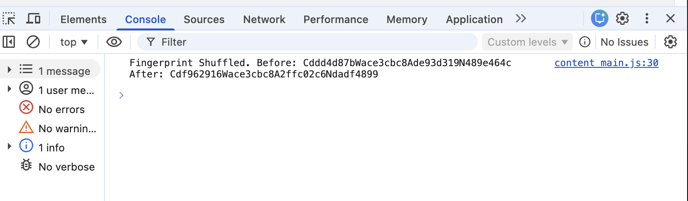

# Browser Fingerprint Shuffler

Browser extension that perturbs common fingerprinting surfaces with deterministic, per-origin noise. It keeps sites functional while nudging canvas, WebGL, audio, and navigator fingerprints so they no longer match a stable profile.

## What it does

-   Adds low-level noise to canvas readouts and WebGL fingerprints.
-   Jitters audio context data to break identical hashes.
-   Fuzzes navigator properties (hardware concurrency, device memory, languages).
-   Uses a persistent salt stored in `chrome.storage.local`, with optional per-origin seeds for stable-but-unique noise per site.
-   Logs before/after fingerprints when debugging is enabled.
-   Example console output in DevTools: 

## Loading the unpacked extension in Chrome

-   `git clone` or download this folder to your machine.
-   Open Chrome and visit `chrome://extensions/`.
-   Toggle **Developer mode** (top right).
-   Click **Load unpacked** and select the project root (`browser-fingerprint-shuffler`).
-   Ensure the extension is enabled. Open a page and check the DevTools console for the `Fingerprint Shuffled...` message when hooks run.

Walkthrough video:

https://github.com/user-attachments/assets/b46e7cdd-7c80-4187-8331-2fd7fcb1efd2

## Configuration and debug flag

Settings live in `core/config.js`.

-   Toggle `debug: true` to log storage operations, hook installs, and before/after fingerprint summaries.
-   Each surface can be switched on/off (`enableCanvasNoise`, `enableWebGLMasking`, `enableAudioNoise`, `enableNavigatorFuzz`) and tuned via strength knobs (`canvasNoiseStrength`, `webglJitter`, `audioNoiseStrength`).
-   `perOriginFingerprint: true` derives a different seed per site; set to `false` for a single global fingerprint across all origins.
-   You can also flip `fpConfig.debug = true` from the DevTools console on a page after load for ad-hoc troubleshooting.

## How it works (quick tour)

-   `core/config.js`: runtime toggles and strengths (including `debug`).
-   `core/salts.js`: persistent salt management via `chrome.storage.local`.
-   `core/hash.js` / `core/prng.js`: deterministic seeds and pseudo-random noise.
-   `content/bootstrap.js`: wires salt/seed/noise into `fpEnv`.
-   Hooks (`content/hooks_canvas.js`, `hooks_webgl.js`, `hooks_audio.js`, `hooks_navigator.js`): apply noise/masking to each surface.
-   `content/test_fingerprint.js`: samples fingerprints before/after hooks; logs when debug is on.
-   `content/content_main.js`: orchestrates hook installation and prints the before/after fingerprint summary.

## Verifying it works

-   Open any page with the extension enabled.
-   In DevTools Console, you should see `Fingerprint Shuffled. Before: ... After: ...`.
-   With `debug: true`, additional `[fp]` logs show salts, seeds, and sampler outputs.

## Notes

-   All scripts run as a content script at `document_start` to intercept early fingerprint reads.
-   The project is dependency-free; edits to config take effect after reloading the extension or the tab.
